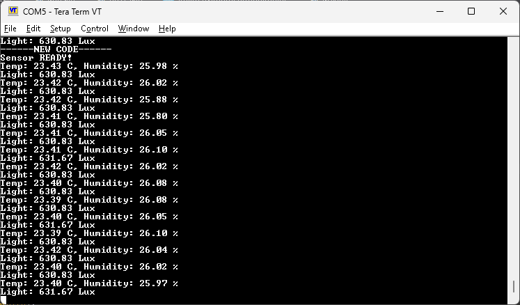

# Smart Environment Data Logger 
Independant personal project done to explore embedded systems.

## Preview

## System Overview
Every 5 seconds, this system measures the light, temperature and humidity of the environment, converts the raw data into actual values, and stores them into an SD Card while displaying the results via UART.

## Components Used
- NUCLEO-F401RE (Microcontroller)
- BH1750 (light sensor)
- DHT20 (temperature and humidity sensor)
- DFR0229 (Micro SD Card Module)
- USB-to-Serial cable
- Jumper wires

## Pin Mapping
| Component        | MCU Pin | Description                    |
|------------------|---------|--------------------------------|
| USART2_TX        | PA2     | UART transmit (to PC)          |
| USART2_RX        | PA3     | UART receive (from PC)         |
| I2C1_SDA         | PB9     | I2C data transmit and receive  |
| I2C1_SCL         | PB8     | I2C clock                      |
| SPI2_CS          | PC6     | SPI Control line               |
| SPI2_MOSI        | PB15    | SPI data transmit (to slave)   |
| SPI2_MISO        | PB14    | SPI data receive (from slave)  |
| SPI2_SCK         | PB13    | SPI clock                      |

## Architecture
main.c
- System initialization
- Main loop execution

bh1750.c / bh1750.h
- bh1750 initialization
- Read and convert raw light data from bh1750

dht20.c / dht20.h
- dht20 initialization
- Read and convert raw temperature and humidity data from dht20

log.c / log.h
- SD card initialization
- Log data to UART and SD card

## Development environment
- STM32CubeIDE (GNU Arm Embedded Toolchain)
- ST-Link debugger (on-board)
- Tera Term (UART @ 115200 baud)

## Challenges / What I learnt
- Reading and Interpreting Datasheets
- I2C and SPI Communication Protocals
- Fatfs Middleware
- STM32 Development
- Soldering
- Display data via UART

## Copyright
This project uses STM32Cube middleware (HAL, CMSIS, FatFs).
The middleware is unmodified and licensed by STMicroelectronics
and third-party authors. See the STM32Cube firmware package
for full license texts.